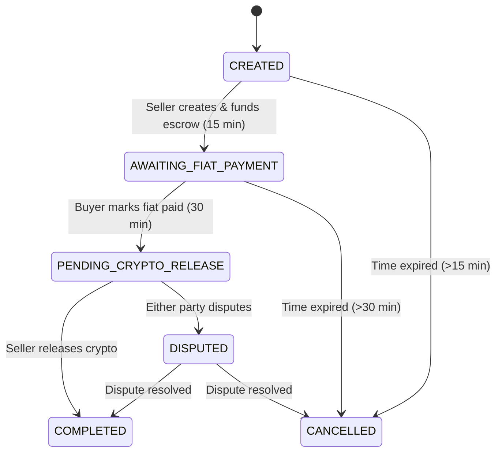

# Trade Process Management System Plan

This document outlines the comprehensive plan for managing the trade process with appropriate action buttons for each stage.

## Understanding the Trade Flow

From analyzing the API, the trade process follows these main states:

1. **CREATED**: Initial state after trade creation
2. **AWAITING_FIAT_PAYMENT**: After seller creates and funds escrow
3. **PENDING_CRYPTO_RELEASE**: After buyer marks fiat as paid
4. **COMPLETED**: After seller releases crypto
5. **DISPUTED**: If either party raises a dispute
6. **CANCELLED**: If trade is cancelled based on time limits

## Time-Based Cancellation Rules

Important rules for cancellation:

1. When a trade is CREATED, the seller has 15 minutes to fund the escrow, during which no cancellation is possible.
2. After the escrow is funded (AWAITING_FIAT_PAYMENT), the buyer has 30 minutes to mark fiat as paid, during which no cancellation is possible.
3. Cancellation is only possible after these time limits have expired.

## Component Structure

### 1. TradeStatusDisplay Component

```tsx
// src/components/TradeStatusDisplay.tsx
interface TradeStatusDisplayProps {
  state: Trade['leg1_state'];
  userRole: 'buyer' | 'seller';
  trade: Trade;
  onCreateEscrow: () => void;
  onFundEscrow: () => void;
  onMarkFiatPaid: () => void;
  onReleaseCrypto: () => void;
  onDisputeTrade: () => void;
  onCancelTrade: () => void;
}
```

### 2. TradeProgressBar Component

```tsx
// src/components/TradeProgressBar.tsx
interface TradeProgressBarProps {
  state: Trade['leg1_state'];
}
```

### 3. TradeActionButton Component

```tsx
// src/components/TradeActionButton.tsx
interface TradeActionButtonProps {
  action: 'create_escrow' | 'fund_escrow' | 'mark_paid' | 'release' | 'dispute' | 'cancel';
  onClick: () => void;
  disabled?: boolean;
}
```

### 4. TradeTimer Component

```tsx
// src/components/TradeTimer.tsx
interface TradeTimerProps {
  deadline: string | null;
  onExpire: () => void;
  label: string;
}
```

## Trade State Management

We need to map each trade state to:
1. Progress percentage
2. Available actions for each user role
3. Status messages for each user role
4. Time limits and deadlines



## Action Mapping by State, Role, and Time

| State | Seller Actions | Buyer Actions | Time Conditions |
|-------|---------------|--------------|-----------------|
| CREATED | Create Escrow | Wait | No cancellation during 15 min escrow creation window |
| AWAITING_FIAT_PAYMENT | Wait, Cancel (after time limit) | Mark Fiat Paid, Cancel (after time limit) | No cancellation during 30 min payment window |
| PENDING_CRYPTO_RELEASE | Release Crypto, Dispute | Wait, Dispute | No time limit for release |
| DISPUTED | Wait | Wait | Handled by dispute resolution process |
| COMPLETED | None | None | Final state |
| CANCELLED | None | None | Final state |

## Time Limit Tracking

We need to track and display time limits:

1. For CREATED state: Track time until escrow funding deadline
2. For AWAITING_FIAT_PAYMENT state: Track time until fiat payment deadline

```tsx
function isDeadlineExpired(deadline: string | null): boolean {
  if (!deadline) return false;
  const deadlineTime = new Date(deadline).getTime();
  const currentTime = new Date().getTime();
  return currentTime > deadlineTime;
}
```

## Real-time Updates with Polling

To implement real-time updates:

1. Create a polling interval to check for trade updates
2. Fetch trade updates from the backend API
3. Update the UI when trade state changes

```tsx
// src/hooks/useTradeUpdates.ts
function useTradeUpdates(tradeId: number) {
  const [trade, setTrade] = useState<Trade | null>(null);

  useEffect(() => {
    const POLL_INTERVAL = 5000; // 5 seconds

    const fetchTrade = async () => {
      try {
        const response = await fetch(`${API_URL}/trades/${tradeId}`);
        const updatedTrade = await response.json();
        setTrade(updatedTrade);
      } catch (error) {
        console.error('Error fetching trade:', error);
      }
    };

    // Initial fetch
    fetchTrade();

    // Set up polling
    const interval = setInterval(fetchTrade, POLL_INTERVAL);

    // Cleanup
    return () => {
      clearInterval(interval);
    };
  }, [tradeId]);

  return trade;
}
```

## Implementation Plan

1. **Create TradeStatusDisplay Component**:
   - Display current state with appropriate styling
   - Show different messages based on user role
   - Render action buttons based on state, role, and time conditions
   - Include countdown timers for relevant states

2. **Create TradeProgressBar Component**:
   - Use the Progress component to visualize trade progress
   - Map trade states to progress percentages (e.g., CREATED: 0%, AWAITING_FIAT_PAYMENT: 33%, etc.)

3. **Create TradeTimer Component**:
   - Display countdown to deadlines
   - Trigger actions when deadlines expire
   - Update UI based on time remaining

4. **Implement Action Handlers**:
   - Create escrow handler
   - Fund escrow handler
   - Mark fiat paid handler
   - Release crypto handler
   - Dispute handler
   - Cancel handler (with time-based conditions)

5. **Set Up SSE for Real-time Updates**:
   - Create a custom hook for SSE connection
   - Update trade state in real-time
   - Re-render UI components when trade state changes

6. **Update TradePage Component**:
   - Integrate TradeStatusDisplay
   - Pass necessary props and handlers
   - Determine user role based on account ID

## Detailed Component Implementation

### TradeStatusDisplay Component

This will be the main component that:
1. Shows the current state with a status badge
2. Displays a progress bar
3. Shows appropriate action buttons based on state, role, and time conditions
4. Displays waiting messages when appropriate
5. Shows countdown timers for relevant deadlines

The component will need to:
- Determine which actions are available based on state, role, and time conditions
- Handle action button clicks
- Show appropriate status messages
- Display countdown timers

### TradeTimer Component

This component will:
- Display a countdown to a specific deadline
- Format the remaining time in a user-friendly way
- Trigger callbacks when the deadline expires
- Update in real-time

### TradeProgressBar Component

This component will:
- Map trade states to progress percentages
- Use the Progress component to visualize progress
- Update in real-time when trade state changes

### SSE Implementation

For real-time updates, we'll need to:
1. Create an EventSource connection to the backend
2. Listen for trade update events
3. Update the local state when events are received
4. Close the connection when component unmounts

## Next Steps

1. Implement the TradeStatusDisplay component with time-based conditions
2. Implement the TradeTimer component for deadline tracking
3. Implement the TradeProgressBar component
4. Set up SSE for real-time updates
5. Integrate with TradePage
6. Test the entire flow with different user roles, states, and time conditions
